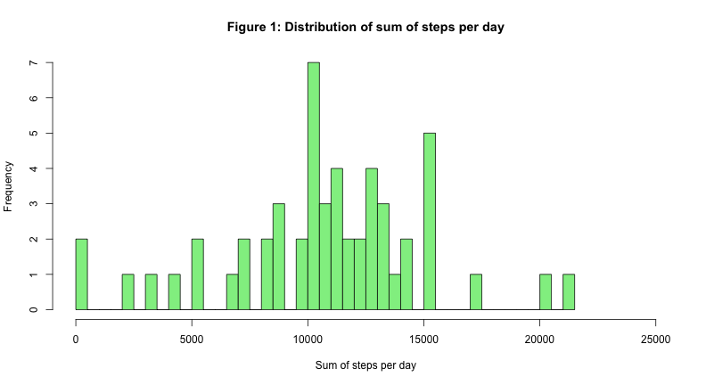
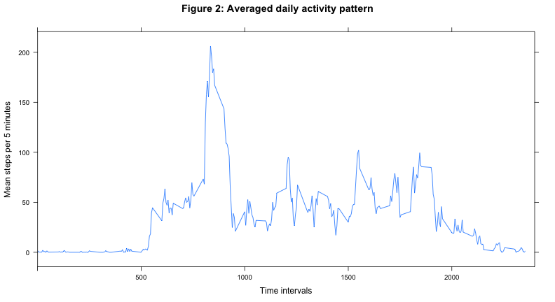
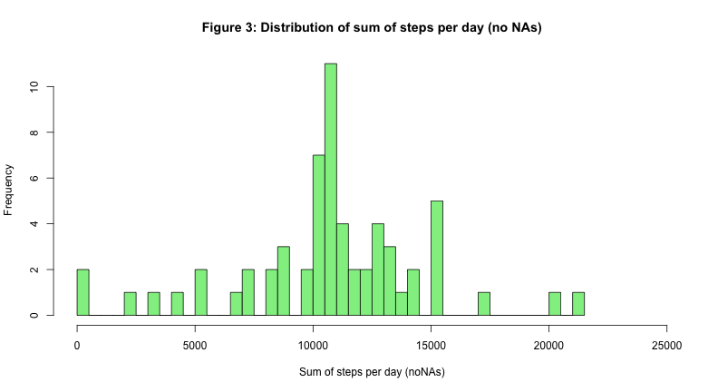
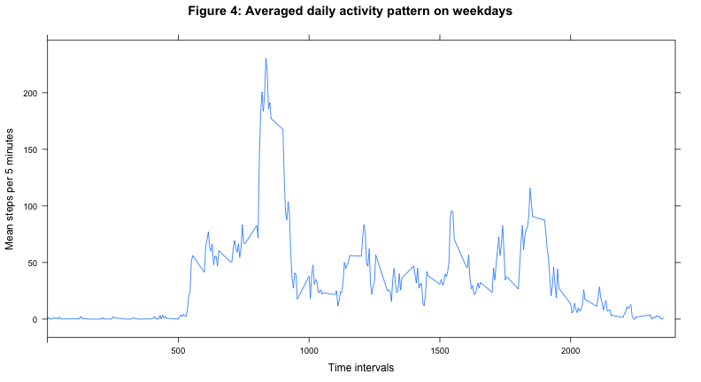
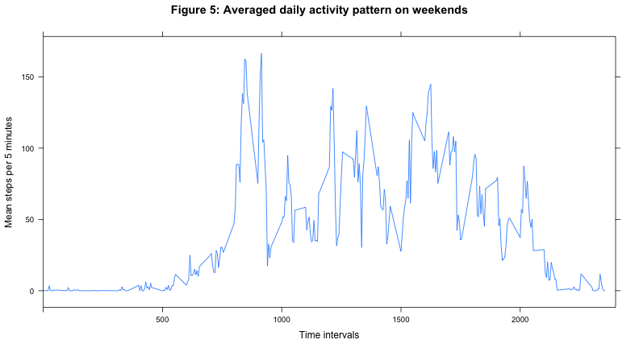

# Coursera - Data Science
==========================
## 5. Reproducible Research: "Peer Assessment 1"
-----------------------------------------------
<br />
<br />
<br />


### Loading and preprocessing the data

1. Import "activity" data 
2. Convert "date"" column to date format

```r
activity_pre <- read.csv("activity.csv")
activity_pre$date <- as.Date(activity_pre$date, format = "%Y-%m-%d")
activity <- activity_pre
```
<br />
<br />


### What is mean total number of steps taken per day?

1. Calculate the sum of steps per day and generate histogram

```r
agg_data_sum <- aggregate(activity$steps ~ date, activity, sum)
hist(agg_data_sum[,2], breaks=53, xlim=c(0,25000), xlab="Sum of steps per day", 
     main="Figure 1: Distribution of sum of steps per day", col="lightgreen")
```

 

2. Calculate the mean and median total number of steps taken per day

```r
mean_day <- round(mean(agg_data_sum[,2]), digits=1)
median_day <- median(sort(agg_data_sum[,2]))
paste("Mean steps per day:", mean_day); paste("Median steps per day:", median_day)
```

```
## [1] "Mean steps per day: 10766.2"
```

```
## [1] "Median steps per day: 10765"
```
<br />
<br />


### What is the average daily activity pattern?

1. Make a time series plot (i.e. type = "l") of the 5-minute interval (x-axis) and the average number of steps taken, averaged across all days (y-axis)

```r
agg_data_mean <- aggregate(activity$steps ~ interval, activity, mean)
library(lattice)
xyplot(agg_data_mean[,2] ~ agg_data_mean[,1], data = agg_data_mean, type="l", 
       main="Figure 2: Averaged daily activity pattern", ylab="Mean steps per 5 minutes", 
       xlim = c(0,2400), xlab="Time intervals")
```

 

2. Find which 5-minute interval has maximum mean number of steps

```r
pos_high <- which(agg_data_mean[,2] == max(agg_data_mean[,2]))
paste("5-minute interval with maximum mean number of steps:", agg_data_mean[pos_high,1])
```

```
## [1] "5-minute interval with maximum mean number of steps: 835"
```
<br />
<br />


### Imputing missing values

1. Calculate number of rows with NAs

```r
sum_NA <- sum(is.na(activity$steps))
paste("Number of NAs in column 'steps' (all others columns have no NAs):", sum_NA)
```

```
## [1] "Number of NAs in column 'steps' (all others columns have no NAs): 2304"
```


2. Filling in all of the missing values (NA) in the dataset using the mean for that 5-minute interval.

```r
activity_replaced <- activity
head(activity_replaced)
```

```
##   steps       date interval
## 1    NA 2012-10-01        0
## 2    NA 2012-10-01        5
## 3    NA 2012-10-01       10
## 4    NA 2012-10-01       15
## 5    NA 2012-10-01       20
## 6    NA 2012-10-01       25
```

```r
for(i in 1:17568){
        if(is.na(activity[i, 1])==TRUE){
         x <- activity[i, 3]
         y <- which(agg_data_mean[, 1] == x)
         activity_replaced[i, 1]  <- agg_data_mean[y, 2]
        }
}
head(activity_replaced)
```

```
##     steps       date interval
## 1 1.71698 2012-10-01        0
## 2 0.33962 2012-10-01        5
## 3 0.13208 2012-10-01       10
## 4 0.15094 2012-10-01       15
## 5 0.07547 2012-10-01       20
## 6 2.09434 2012-10-01       25
```

3. Create a new dataset with the missing data filled in.

```r
write.csv(activity_replaced, file='activity_NA_replaced.csv', row.names=FALSE)
```

4. Make a histogram of the total number of steps taken each day and calculate and report the mean and median total number of steps taken per day.

```r
agg_data_sum_noNA <- aggregate(activity_replaced$steps ~ date, activity_replaced, sum)
hist(agg_data_sum_noNA[,2], breaks=53, xlim=c(0,25000), xlab="Sum of steps per day (noNAs)", main="Figure 3: Distribution of sum of steps per day (no NAs)", col="lightgreen")
```

 


```r
mean_day <- round(mean(agg_data_sum[,2]), digits=1)
mean_day_noNA <- round(mean(agg_data_sum_noNA[,2]), digits=1)
paste("Mean steps per day (with NAs):", mean_day); paste("Mean steps per day (without NAs):", mean_day_noNA)
```

```
## [1] "Mean steps per day (with NAs): 10766.2"
```

```
## [1] "Mean steps per day (without NAs): 10766.2"
```

```r
median_day <- median(sort(agg_data_sum[,2]))
median_day_noNA <- median(sort(agg_data_sum_noNA[,2]))
paste("Median steps per day (with NAs):", median_day); paste("Median steps per day (without NAs):", median_day_noNA)
```

```
## [1] "Median steps per day (with NAs): 10765"
```

```
## [1] "Median steps per day (without NAs): 10766.1886792453"
```
<br />
<br />


### Are there differences in activity patterns between weekdays and weekends?

1. Create a new factor variable indicating whether weekday or weekend day.

```r
activity_replaced_weekday <- activity_replaced
wkday <- c("Monday", "Tuesday", "Wednesday", "Thursday", "Friday")
wkend <- c("Saturday", "Sunday")
for(j in 1:17568){
        if(weekdays(activity_replaced_weekday[j,2]) %in% wkday){
                activity_replaced_weekday[j,4] <- "weekday"
        } else {
                activity_replaced_weekday[j,4] <- "weekend"
                }
}
```


2. Make a panel plot containing a time series plot of the 5-minute interval and the average number of steps taken, averaged across all weekday days or weekend days.

```r
agg_data_mean_wk <- aggregate(activity_replaced_weekday$steps ~ interval+V4, activity_replaced_weekday, mean)
mean_weekday <- subset(agg_data_mean_wk, V4 == "weekday")
mean_weekend <- subset(agg_data_mean_wk, V4 == "weekend")
xyplot(mean_weekday[, 3] ~ mean_weekday[,1], data = mean_weekday, type="l", main="Figure 4: Averaged daily activity pattern on weekdays", ylab="Mean steps per 5 minutes", xlim = c(0,2400), xlab="Time intervals"); xyplot(mean_weekend[, 3] ~ mean_weekend[,1], data = mean_weekend, type="l", main="Figure 5: Averaged daily activity pattern on weekends", ylab="Mean steps per 5 minutes", xlim = c(0,2400), xlab="Time intervals")
```

  
